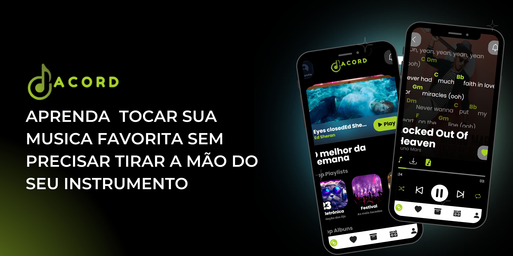

    
    <h1>Acord</h1>
    
Projeto de um site PWA de Streaming de audio,cifras e letras sinconizadas

    

        <a href="#sobre" target="_blank">Sobre</a>
        <a href="#tecnologias">Tecnologias</a>
        <a href="#pre-requisitos">Pré requisitos</a>
        <a href="#como-usar">Como Usar?</a>
        <a href="#autor">Autor</a>
    

    <h3>Sobre</h3>
    
O projeto em si foi idealizado somente como um estudo de front-end, a idéia foi fazer um player de musicas
    com funcionalidades que se adapatassem para dispositivos mobile, com cifras e letras sinconizadas, e para aqueles que só querem ouvir uma boa musica um player normal.

    
Por isso não foi feito um banco de dados para armazenar varios generos musicais,faixa de musicas, lyrics e arquivos chord.pro

    
A grande funcionalidade desse projeto é ajudar os musicos a tocar a sua musica farovita sem ter que tirar a mão do seu instrumento pra rolar a página.

    

        
    

    <h3>Tecnologias</h3>
    
 
        
        
        
    

    <h3>Pré requisitos</h3>

    <h3>Como Usar?</h3>

    <h3>Autor</h3>

    