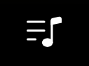
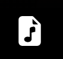

    
    <h1>Acord</h1>
    
Projeto de um site PWA de Streaming de audio,cifras e letras sinconizadas

    

        <a href="#sobre" color="green">Sobre</a>
        <a href="#tecnologias">Tecnologias</a>
        <a href="#pre-requisitos">Pré requisitos</a>
        <a href="#como-usar">Como Usar?</a>
        <a href="#autor">Autor</a>
    

    <h3>Sobre</h3>
    
O projeto em si foi idealizado somente como um estudo de front-end, a idéia foi fazer um player de musicas
    com funcionalidades que se adapatassem para dispositivos mobile, com cifras e letras sinconizadas, e para aqueles que só querem ouvir uma boa musica um player normal.

    
Por isso não foi feito um banco de dados para armazenar varios generos musicais,faixa de musicas, lyrics e arquivos chord.pro

    
A grande funcionalidade desse projeto é ajudar os musicos a tocar a sua musica farovita sem ter que tirar a mão do seu instrumento pra rolar a página.

    

        
    

    <h3>Tecnologias</h3>
    
As tecnologias ultizadas foram HTML, CSS, JAVASCRIPT, para os aquivos que comportam as letras das musicas foi utilizada a extensão .lyric e paras os aquivos de cifras a extensão .chordPro

    
Também foi usado uma API em JavaScript para fazer as seções deslizantes das 
    categorias do site chamada Swiperjs

    <li>saiba mais sobre o Swiperjs clicando <a href="https://swiperjs.com/">Aqui!</a></li>
    
 
        
        
        
        
    

    <h3>Pré requisitos</h3>
    <li>Apenas internet</li>

    <h3>Como Usar?</h3>
    
<li>Acesse o site clicando<a href="https://elesonsilva.github.io/Acord">Aqui!</a></li>

    
Acord é responsivo pra qualquer dispositivo, seja PC, tablet ou Smartphone.

    <li>Clique em fazer login com o Google ou Twitter <strong>Não vamos pedir nenhum dado seu! Essa tela so foi criada por questões de estrutura e padronização dos sites</strong></li>
    
    
<li>Na pagina principal naveque nas playlist ou artitas favoritos e escolha qual estilo de musica deseja
     escutar</li>

    
    
<li>Na pagina da playList clique em  PLAY ou na sua musica de preferencia</li>

    
     
    
<li>Ao abrir a Musica começa a tocar automaticamente mais as funções de letra e cifra referente a musica estão fechadas</li>
    <li>Para abrir ou fechar a função de letra click no icone</li>
        
    <li>Para abrir ou fechar a função de cifra click no icone</li>
        
    

        

    <h3>Autor</h3>
    <a href="#">
 
  
 <b>Éleson Silva</b></a> 
 
Feito com ❤️ por Éleson Silva 👋🏽 Entre em contato!

    
 
     
         
    
     
    

    